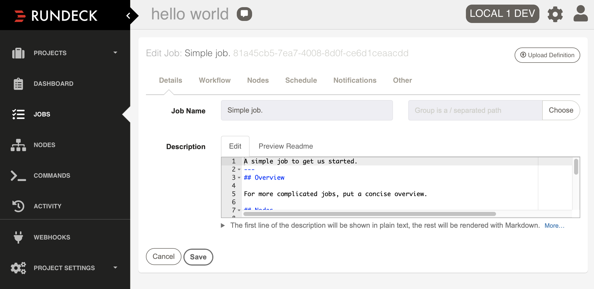

# Fundamentals <!-- .element class="r-fit-text" -->

_More like "Fundeck", amirite?_

---

## What is Rundeck ?

Rundeck allows you to manage **physical** or **virtual** infrastructure resources by performing automated tasks, on-demand or on a schedule.

---

## Projects

- collections of **nodes** + **jobs**
- main unit of organization & access control
---
### Project: Dashboard

 <!-- .element height="70%" width="70%" -->

nodes + jobs, settings, readme, motd, ACLs, webhooks, SCM import/export

---

### Project: Access Control

 <!-- .element height="70%" width="70%" -->

Allows _project_ admins to adjust policy separate from system-wide ACLs.

---
### Project: ACL Policy

```yaml
description: SysV access to hello-world project resources.
for:
  resource:
    - allow: '*' # allow read/create all kinds
  adhoc:
    - allow: '*' # allow read/running/killing adhoc jobs
  job:
    - allow: '*' # allow read/write/delete/run/kill of all jobs
  node:
    - allow: '*' # allow read/run for all nodes
by:
  group: [ cie-eng.systems-v ]
```

* [Access Control Policy](https://docs.rundeck.com/docs/administration/security/authorization.html#rundeck-resource-authorizations)
* [ACLPOLICY](https://docs.rundeck.com/docs/manual/document-format-reference/aclpolicy-v10.html#for)

---
## Nodes

- **physical** or **virtual** resources you want to manage with Rundeck
- configured via **node (resource) model sources** per project
- always have one **local node**, the rundeck server itself
- **node executors** determine _how_ job steps are run against nodes

---

### Nodes: Resource Model Sources

* A set of **node descriptors**, each with a **unique name**.
* **Name** and **hostname** are _required_.
* A project can have multiple node resouce model sources defined.
* **Node executors** will impose additional field requirements.
* Can also include Rundeck-specific config options and arbitrary metadata.

---

### Nodes: Resource Model Sources

🔥 **Tip:**  Not all necessary fields need to be present in node data. Some fields can be "inherited" from Rundeck- or project-level configs.

---

### Nodes: Resource Model Plugins

* Built-in:
  * [File](https://docs.rundeck.com/docs/administration/projects/resource-model-sources/builtin.html#file-source): reads a file
  * [URL](https://docs.rundeck.com/docs/administration/projects/resource-model-sources/builtin.html#url-source): http GET request
  * [Directory](https://docs.rundeck.com/docs/administration/projects/resource-model-sources/builtin.html#directory-source): loads each file in a directory
  * [Script](https://docs.rundeck.com/docs/administration/projects/resource-model-sources/builtin.html#script-source): executes a script file and reads the output
* Third-party examples: [ec2-nodes-plugin](https://github.com/rundeck-plugins/rundeck-ec2-nodes-plugin), [aws-s3-model-source](https://github.com/rundeck-plugins/aws-s3-model-source), [git-resource-model](https://github.com/rundeck-plugins/git-resource-model), [kubernetes](https://github.com/rundeck-plugins/kubernetes)
---
### Nodes: Simple Example

```json
{
  "host one": {
    "hostname": "host1.test"
  }
}
```

```bash
$ rd nodes list -p hello-world -v
# 2 Nodes in project hello-world:
nodename: host one
  hostname: host1.test

nodename: rundeck-localdev1
  hostname: rundeck-localdev1.vm.d1.strln.net
  osVersion: 4.15.0-144-generic
  osFamily: unix
  osArch: amd64
  description: Rundeck server node
  osName: Linux
```

---
### Nodes: Example with Metadata

```json
{
  "host one": {
    "description": "test host one",
    "hostname": "host1.test",
    "nodename": "host1",
    "tags": "test,us-west-2",
    "other-meta": "anything goes"
  }
}
```

```bash
$ rd nodes list -p hello-world --filter tags:test -v
# 1 Nodes matching filter in project hello-world:
nodename: host1
  description: test host one
  hostname: host1.test
  other-meta: anything goes
  tags: test, us-west-2
```

---
### Nodes: Node Search via GUI


---
## Node Executors

* Execute commands on a remote or local node.
* Works with **FileCopier** services for **script** type commands.
* Can be defined at node or project-level.
* May add configuration options and/or required node information (e.g. username).
* Plugin-based. Built-in and third-party.

See also: [When Node Executors are Invoked](https://docs.rundeck.com/docs/administration/projects/node-execution/builtin.html#when-node-executors-are-invoked)

---
### Node Executors: Built-in

* [Script Node Execution](https://docs.rundeck.com/docs/administration/projects/node-execution/script.html#custom-command-and-script-execution-with-the-script-plugin) (script-exec)
* [SSH Node Execution](https://docs.rundeck.com/docs/administration/projects/node-execution/ssh.html#ssh-system-configuration)
* [PowerShell Node Execution](https://docs.rundeck.com/docs/administration/projects/node-execution/powershell.html)
* [OpenSSH Bastion Host Node Execution](https://docs.rundeck.com/docs/administration/projects/node-execution/bastionssh.html#dry-run-mode)
* [OpenSSH Node Execution](https://docs.rundeck.com/docs/administration/projects/node-execution/openssh.html#requirements)
* [Stub](https://docs.rundeck.com/docs/administration/configuration/plugins/bundled-plugins.html#stub-plugin)

---
### Node Executors: Script Exec

Enabled by **script-plugin** and includes:

* `script-copy` for the FileCopier service
* `script-exec` for the NodeExecutor service

**Copy** a script to a node (local or remote) and then **execute** it using whatever mechanisms are needed.


---
### script-exec: Examples

Node definitions:

```yaml
mynode:
    node-executor: script-exec
    script-exec: /bin/execremote -host ${node.hostname} -user ${node.username} -- ${exec.command}
```

```yaml
mynode:
    node-executor: script-exec
    script-exec-shell: bash -c
    script-exec: ssh -o "some quoted option" ${node.username}@${node.hostname} ${exec.command}
```

`project.properties` or `framework.properties`:

```yaml
script-exec.default.command=/bin/execremote -host ${node.hostname} \
    -user ${node.username} -- ${exec.command}
```


---
### script-copy: Examples

Node definitions:

```yaml
mynode:
    file-copier: script-copy
    script-copy: /bin/copyremote -host ${node.hostname} -user ${node.username} -- ${file-copy.file} ${file-copy.destination}
```

`project.properties` or `framework.properties`:

```yaml
script-copy.default.command=/bin/copyremote -host ${node.hostname} -user ${node.username} -- ${file-copy.file} ${file-copy.destination}
```

---
### Script Exec Example: Canary VMs

```bash
$ rd nodes list -p canary-vms --filter lab-dub1.edc -v
# 1 Nodes matching filter in project canary-vms:
canary_vm_group_ids:canary_v3: 4341ebf6-12dc-40be-abf6-425b5cdb87f6
  script-copy-remote-filepath: ${node.destdir}/${file-copy.filename}
  node-executor: script-exec
  file-copier: script-copy
  script-exec-shell: bash -c
  nodename: lab-dub1.edc
  hostname: local
  destdir: /tmp
  script-copy-shell: bash -c
  script-copy: cp ${file-copy.file} ${file-copy.destination}
  script-exec: ${exec.command}
```

---
### SSH Node Execution

* Default for executing commands on remote nodes.
* Makes `hostname` and `username` required for every node.
* Must configure public/private ssh keypair or SSH password auth.
* Works with **SCP File Copier** for script execution on remote nodes.
* Can configure options at Rundeck, project, or node-level.

---
### Node Executors: Third-Party Plugins

* [kubernetes](https://github.com/rundeck-plugins/kubernetes#node-executor)
* [rundeck-ansible-plugin](https://github.com/Batix/rundeck-ansible-plugin#node-executor)

---
## Jobs

A job is a collected configuration of **documentation**, **input options**, **workflow steps**, **nodes** where steps will execute, **execution control parameters**.

Jobs can have **notifications** for different event triggers and have a **schedule** attached for unattended execution.

---
### Jobs: Details

* **Name:** Human-readable. Use sentance or title case.
* **Group:** Organize jobs in folders.
* **Description:** First line is short decription rendered in plain text the rest in Markdown.

---
### Jobs: Details



---
### Jobs: Nodes

- **Execute locally:** execute job on local node
- **Dispatch to nodes:** execute job against (remote) nodes
  - **node filters:** include and exclude nodes based on attributes
  - **node rank:** how to rank nodes (used in orchestration)
  - **orchestrator:** control the order and timing for which nodes are processed
  - **thread count:** number of parallel execution threads

---
### Jobs: Nodes


<div class="r-stack">

<!-- .element height="90%" width="90%" class="fragment fade-out" data-fragment-index="0" --> 

 <!-- .element height="90%" width="90%" class="fragment current-visible" data-fragment-index="0" -->
</div>

---
### Jobs: Nodes & Executors 

🔥 **Tip:** Creatively using **node executors** allows you to iterate over **nodes** to do all kinds of work.

e.g. Use `script-exec` to run scripts locally but _against_ a set of nodes.

---
### Jobs: Workflow
- input **options**
- a collection of **workflow steps**
- what to do in a **failure** scenario
- execution **strategy** (how to execute multiple steps on nodes)
- global **log filters**

---
### Jobs: Workflow

  <!-- .element height="80%" width="80%" -->

---
### Workflow: Failure Scenarios

options for what to do in a failure scenario:

- stop at failed step
- run remaining steps

 <!-- .element height="70%" width="70%" -->
 
---
### Workflow: Execution Strategy

options for how to execute multiple steps on nodes

- **node first:** Execute all steps on a node before proceeding to the next node.
- **parallel:** Run all steps in parallel
- **sequential:** Run each step in order. Execute a step on all nodes before proceeding to the next step

---
### Workflow: Execution Strategy

🔥 **Tip:** Use the built-in hints!

<div class="r-stack">

 <!-- .element height="70%" width="70%" class="fragment fade-out" data-fragment-index="0" -->

 <!-- .element height="70%" width="70%" class="fragment current-visible" data-fragment-index="0" -->
</div>

---
### Workflow: Log Filters

* Process job step output in various ways.
* Filter output for **all** steps (global) or for **individual** steps.
* Global filters are processed first.

---
### Workflow: Log Filter Types

- capture key/value data output
- quiet output
- highlight output
- mask passwords and other output
- render data

---
### Workflow: Log Filters

 <!-- .element height="50%" width="50%" -->

<div class="r-stack">

 <!-- .element height="40%" width="40%" class="fragment fade-out" data-fragment-index="0" -->

 <!-- .element height="40%" width="40%" class="fragment current-visible" data-fragment-index="0" -->
</div>

---
### Workflow: Steps

- individual units of work in a job
- can have as many steps as you like > 0
- can be re-ordered
- **node** steps and **workflow** steps
- plugins can have both _node_ and _workflow_ steps

---
### Workflow: Steps


---
### Workflow: Node Steps vs Workflow Steps

* **Node Steps:** Run once for **each node** in the workflow.
* **Workflow Steps:** Run only **once** in a job's workflow.

---
### Workflow: Node Steps 

- **Command:** Execute a remote command.
- **Script:** Execute an inline script.
- **Script file or url:**  Execute script from URL or on local filesystem.
- **Job Reference:** call another saved Job 
- **Copy File:** Copy a file to a destination on a remote node.
- **Local Command:** Run a command on local server node.
- **Data Node Step:** Produce data values for a node.

---
### Workflow: Node Steps 


<div class="r-stack">

 <!-- .element height="90%" width="90%" class="fragment fade-out" data-fragment-index="0" --> 

<!-- .element height="90%" width="90%" class="fragment current-visible" data-fragment-index="0" -->

 <!-- .element height="90%" width="90%" class="fragment" -->
</div>


---
### Workflow: Workflow Steps

- **Job Reference:** Execute another job.
- **Global Variable:** Creates a global variable to be used in other steps or in notifications.
- **Flow Control:** For use with step error handling.
- **Job State Control:** Verify if a job is running and/or checks the lastest execution status.
- **Log Data Step:** Log all the context data values.
- **Refresh Project Nodes:** Refresh all the nodes in a project.
- **Data Step:** Produce data values.

---
### Workflow: Workflow Steps


---
### Workflow: Workflow Steps

🔥 **Tip:** When using the **Refresh Project Nodes** step, the refreshed nodes will be available in any subsequent Job Reference step, but not within the current workflow.

---
### Workflow: Useful Step Plugins

* [rundeck-ansible-plugin](https://github.com/Batix/rundeck-ansible-plugin): Run ansible playbooks and modules.
* [http-step](https://github.com/rundeck-plugins/http-step): Send HTTP requests.
* [git-plugin](https://github.com/rundeck-plugins/git-plugin): Clone git repositories.
* [aws-s3-steps](https://github.com/rundeck-plugins/aws-s3-steps): Wrapper around S3 commands.

---
### Workflow: Workflow Steps

🔥 **Tip:** Workflow plugins are one option for encapsulating and organizing tasks.

Most Rundeck components support custom [Script Plugins](https://docs.rundeck.com/docs/learning/howto/custom-script-plugin-hello-world.html).

Ideas: Activating python virtual environments, pulling resources from git, interacting with Concourse, querying AWS.

---
### Job: Executions

- a run of a job against a particular set of nodes
- includes output from the run, grouped by node

---
### Executions: Example

 <!-- .element height="70%" width="70%" -->

---
### Executions: Example

<div class="r-stack">

 <!-- .element height="70%" width="70%" class="fragment fade-out" data-fragment-index="0" --> 

 <!-- .element height="70%" width="70%" class="fragment current-visible" data-fragment-index="0" -->
</div>

---
### Executions: Logs & Records


🔥 **Tip:** For every _execution_, Rundeck saves a copy of the job as it was when it was run against nodes. Can be useful for trouble-shooting.

🚨 **Gotcha!:** Halting an **running** execution doesn't always stop all processes spawned by the job. Use with caution.

---
### Job: Schedules

- run a job on a schedule (like cron)
- schedule is embedded in job definition (for OSS version)
- schedule has to be enabled for job to be executed
- running scheduled jobs can be toggled at the project level

---
### Schedules: Configuration

 <!-- .element height="80%" width="80%" -->
 
---
### Job: Schedules

🚨 **Gotcha!:** A _scheduled execution_ runs as the **user** who last saved the job.

---
### Job: Notifications

- Generate notifications in response to event **triggers**.
- Different **notification plugin** types.

---
### Job Notifications: Triggers

- on start
- on success
- on failure
- on retryable failure
- avg duration exceeded

---
### Job Notifications: Types

- email
- webhook
- pagerduty
- wxt
- and more!

---
### Job Notifications: Configuration

<div class="r-stack">

<!-- .element height="70%" width="70%" class="fragment fade-out" data-fragment-index="0" --> 

 <!-- .element height="70%" width="70%" class="fragment current-visible" data-fragment-index="0" -->

 <!-- .element height="70%" width="70%" class="fragment" -->

 <!-- .element height="70%" width="70%" class="fragment" -->
 

</div>

---
### Job Notifications

🔥 **Tip:** When the information isn't specific to the triggering event, use the [http-step](https://github.com/rundeck-plugins/http-step) or another custom plugin to post messages to other systems rather than notification plugins.


---
### Job: Options

* log level
* multiple executions (y/n), how many
* timeout
* retry attempts, retry delay
* log limits (lines, halt/truncate)A
* default tab for execution follow

---
### Job: Options


